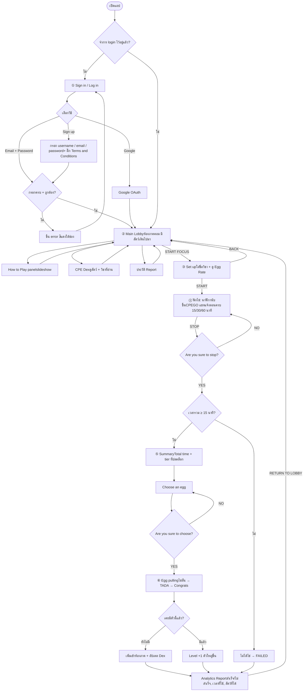
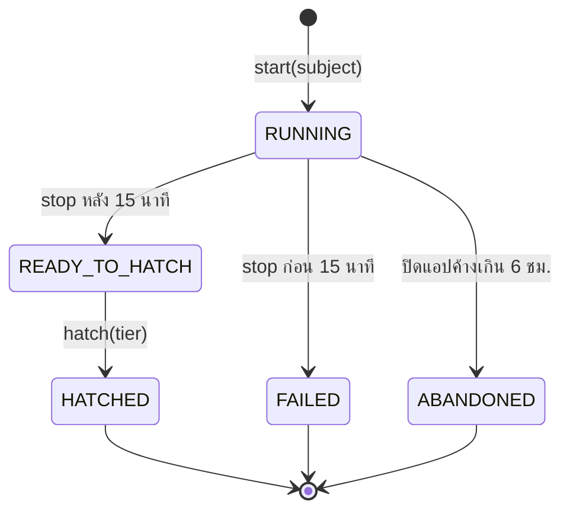
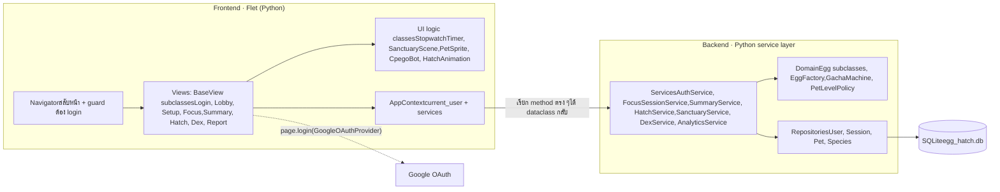
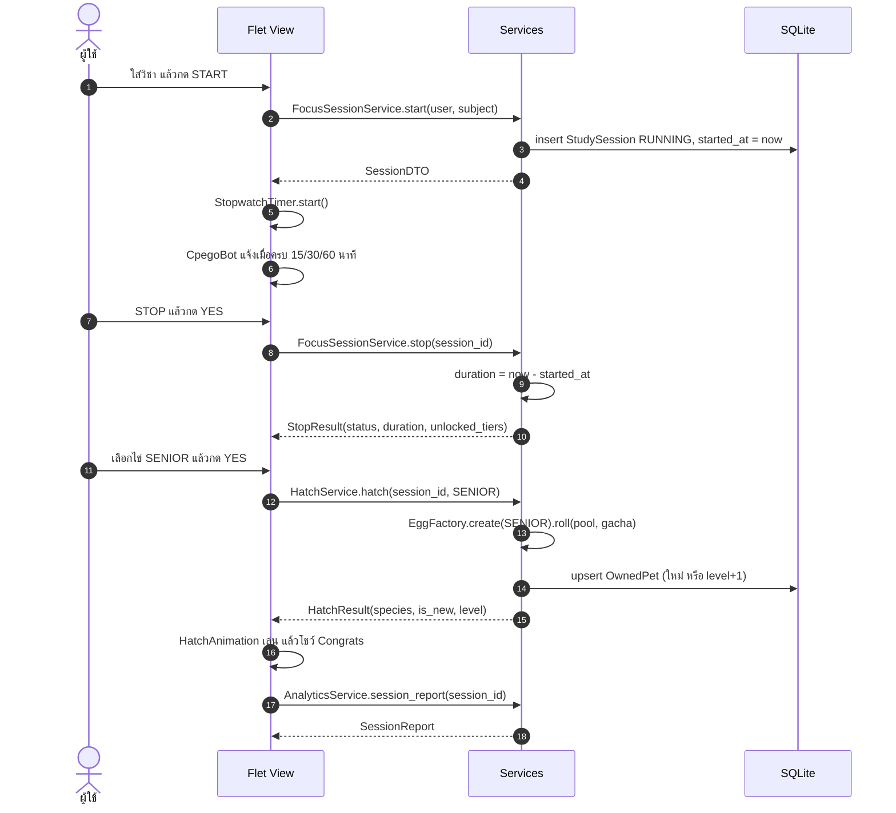
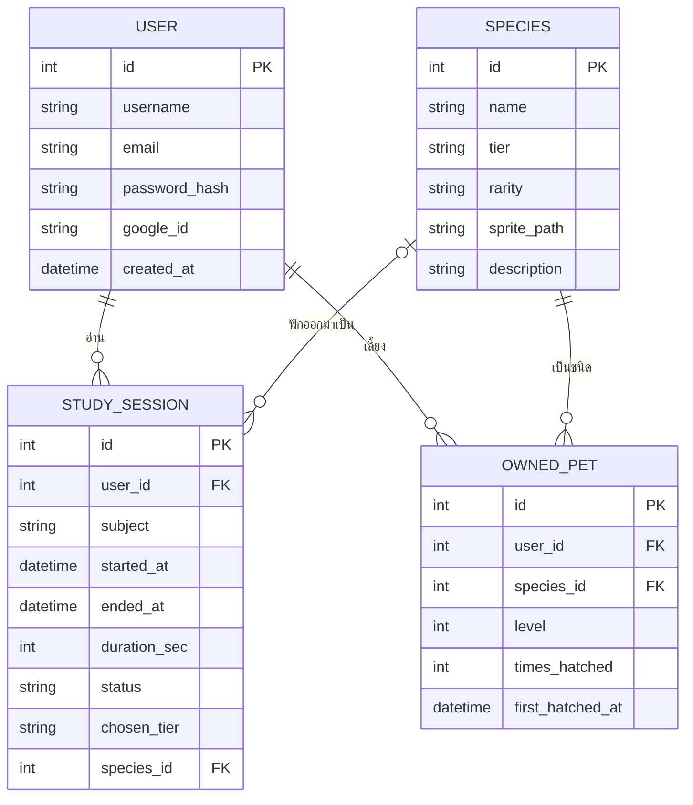
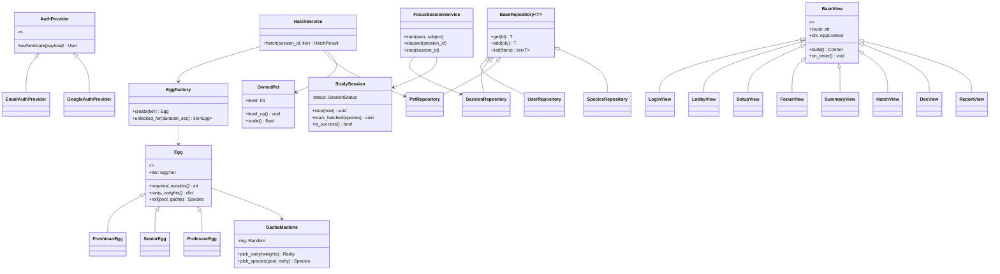

# COMPRO_group_proj
Dev By VidvaTom
Compro final · System design · Python only

# CPE Egg Hatch Blueprint

อ่านหนังสือ = กกไข่ อ่านครบเวลาไข่ก็ฟัก ได้สัตว์มาเดินดุ๊กดิ๊กในห้องภาค หน้านี้รวม game rules, flow chart, pipeline frontend/backend, data model, class diagram และการแบ่งงาน OOP ให้ทีม 9 คน เขียนด้วย Python ทั้งโปรเจกต์

[กติกาเกม](#rules)[User flow](#flow)[Session state](#state)[Pipeline FE/BE](#pipeline)[Sequence](#sequence)[Service contract](#services)[Data model](#data)[OOP classes](#oop)[Folder](#folders)[แบ่งงาน 9 คน](#team)[แผนงาน](#phases)

สมมติฐานที่ใช้ (แก้ได้ถ้าทีมตกลงกันแล้วเป็นอย่างอื่น)

- **Python ล้วน** ทั้งโปรเจกต์ · Frontend: **Flet** (เขียน UI ด้วย Python, รันได้ทั้ง desktop, web และมือถือ, มี Google OAuth ในตัว) · Backend: **service layer ใน Python + SQLAlchemy + SQLite**
- Frontend กับ backend อยู่ในโปรแกรมเดียวกัน แยกกันด้วย layer: หน้าจอเรียก `Service` เท่านั้น ห้ามแตะ database ตรง ๆ
- นาฬิกาเป็น **นับขึ้น** ตาม wireframe ข้อ 4 แล้วตอน Stop ค่อยดูว่าเวลาถึง tier ไหน · เวลาคิดจาก `started_at` ที่บันทึกใน database
- ไม่มีระบบไข่ร้าว ไข่ไม่สำเร็จได้ทางเดียวคือกด Stop ก่อนครบ 15 นาที

## กติกาเกม

| Tier | ชื่อไข่ | เวลาขั้นต่ำ | Common | Rare | Epic | Legendary |
| --- | --- | --- | --- | --- | --- | --- |
| `FRESHMAN` | ไข่รุ่นเรา | 15 นาที | 70% | 25% | 5% | 0% |
| `SENIOR` | ไข่รุ่นพี่ | 30 นาที | 40% | 40% | 17% | 3% |
| `PROFESSOR` | ไข่อาจารย์ (God Egg) | 60 นาที | 10% | 40% | 35% | 15% |

**ปลดล็อก tier**

กด Stop แล้วเวลารวม ≥ เวลาขั้นต่ำของ tier ไหน ก็เลือกไข่ tier นั้นหรือต่ำกว่าได้ (หน้า Summary: Choose an egg)

**หยุดก่อน 15 นาที**

กด Stop แล้วยืนยัน "Are you sure to stop?" ก่อน 15 นาที = ไม่ได้ไข่ บันทึกเป็น FAILED ลง report

**CPEGO แชท**

ระหว่างอ่าน CPEGO ส่งข้อความตอนครบ 15 / 30 / 60 นาที บอกว่าปลดล็อกไข่ระดับไหนแล้ว และชวนอ่านต่อเพื่อ swap เป็นไข่ที่ดีกว่า

**ได้ตัวซ้ำ**

ถ้ายังไม่เคยมี: เพิ่มเข้าห้องภาค + ปลดล็อกใน CPE Dex · ถ้ามีแล้ว: level +1 ตัวใหญ่ขึ้น 15% ต่อ level (สูงสุด 2 เท่า)

## User flow chart

ตาม wireframe ①–⑥ บวกหน้า Analytics Report ต่อท้ายทุก session ทั้งสำเร็จและไม่สำเร็จ



## Study session state

หัวใจของระบบคือ `StudySession` ทุกคนอ้าง status ชุดนี้ชุดเดียว (เป็น `Enum` ใน `domain/enums.py`)



## Pipeline frontend ↔ backend

ทุกชั้นเป็น Python · หน้าจอ (View) เรียกผ่าน `AppContext` ที่ถือ service ทุกตัว · backend แบ่งชั้น Service → Domain → Repository → SQLite



## Sequence: หนึ่งรอบการอ่าน



## Service contract

แทน API แบบ HTTP · หน้าจอเรียก method เหล่านี้ได้อย่างเดียว คืนค่าเป็น `dataclass` ใน `app/dto.py` · คนที่ 2 เป็นเจ้าของ DTO ถ้าจะเปลี่ยน field ต้องแจ้งกลุ่มก่อน

| Service | Method | ใช้ทำอะไร | เจ้าของ |
| --- | --- | --- | --- |
| `AuthService` | `register(username, email, password, accepted_terms)` | สมัครสมาชิก | P1 |
| `AuthService` | `login(email, password)` | ล็อกอินด้วย email | P1 |
| `AuthService` | `login_with_google(google_user)` | หา/สร้าง user จากข้อมูล Google | P1 |
| `AuthService` | `restore_session()` / `logout()` | จำการ login ไว้ในเครื่อง | P1 |
| `TierService` | `list_tiers()` | tier, เวลาขั้นต่ำ, egg rate (หน้า Set up) | P5 |
| `FocusSessionService` | `start(user, subject)` | เริ่ม session | P6 |
| `FocusSessionService` | `elapsed(session_id)` | เวลาที่อ่านไปแล้ว ใช้ให้ CPEGO รู้ milestone | P6 |
| `FocusSessionService` | `stop(session_id)` | หยุด คำนวณเวลา ตัดสิน FAILED หรือ READY_TO_HATCH | P6 |
| `SummaryService` | `get_summary(session_id)` | Total time + ไข่ที่เลือกได้ | P7 |
| `HatchService` | `hatch(session_id, tier)` | สุ่มสัตว์ + เพิ่มตัวใหม่หรือ level up | P8 |
| `SanctuaryService` | `list_pets(user)` | สัตว์ทั้งหมดในห้องภาค + level | P4 |
| `DexService` | `list_entries(user)` | ทุก species พร้อมสถานะ locked/unlocked | P9 |
| `DexService` | `get_entry(user, species_id)` | รายละเอียด + วิชาที่อ่านตอนได้ตัวนี้ | P9 |
| `AnalyticsService` | `session_report(session_id)` | Report ของ session เดียว | P7 |
| `AnalyticsService` | `history(user)` | ประวัติทุก session + สถิติรวม | P9 |

## Data model



## OOP class diagram

จุดที่อาจารย์น่าจะดู: inheritance (`Egg`, `AuthProvider`, `BaseRepository`, `BaseView`), polymorphism (`roll()`, `authenticate()`, `build()`), encapsulation (state ของ session เปลี่ยนผ่าน method เท่านั้น), abstraction (`ABC`)



### ตัวอย่าง: Egg + polymorphism (backend)

```
from abc import ABC, abstractmethod

class Egg(ABC):
    tier: EggTier

    @abstractmethod
    def required_minutes(self) -> int: ...

    @abstractmethod
    def rarity_weights(self) -> dict[Rarity, int]: ...

    def roll(self, pool, gacha: "GachaMachine"):
        rarity = gacha.pick_rarity(self.rarity_weights())
        return gacha.pick_species(pool, rarity)


class SeniorEgg(Egg):
    tier = EggTier.SENIOR

    def required_minutes(self) -> int:
        return 30

    def rarity_weights(self):
        return {Rarity.COMMON: 40, Rarity.RARE: 40,
                Rarity.EPIC: 17, Rarity.LEGENDARY: 3}
```

### ตัวอย่าง: BaseView + Flet (frontend)

```
import flet as ft
from abc import ABC, abstractmethod

class BaseView(ABC):
    route: str = "/"

    def __init__(self, ctx: "AppContext"):
        self.ctx = ctx

    @abstractmethod
    def build(self) -> ft.Control: ...

    def on_enter(self) -> None:
        pass

    def to_view(self) -> ft.View:
        return ft.View(self.route, [self.build()])


class SetupView(BaseView):
    route = "/setup"

    def build(self) -> ft.Control:
        self.subject = ft.TextField(label="วิชาที่จะอ่าน")
        return ft.Column([
            ft.TextButton("BACK", on_click=lambda e: self.ctx.nav.go("/lobby")),
            self.subject,
            ft.FilledButton("START", on_click=self.start),
        ])

    def start(self, e):
        session = self.ctx.focus.start(self.ctx.user, self.subject.value)
        self.ctx.nav.go(f"/focus/{session.id}")
```

## Folder structure

โปรเจกต์ Python เดียว แบ่งตาม feature ทั้งฝั่ง `ui/` และ `app/` แต่ละคนแตะแค่โฟลเดอร์ของตัวเองเป็นหลัก ลด merge conflict

```
cpe_egg_hatch/
├── main.py               P3  ft.app(target=...)
├── ui/                   ← frontend (Flet)
│   ├── core/             P3
│   │   ├── app_context.py
│   │   ├── navigator.py
│   │   ├── base_view.py
│   │   ├── theme.py
│   │   ├── sound_manager.py
│   │   └── widgets/ Panel, ConfirmDialog,
│   │                PixelButton, ScrollPanel
│   ├── auth/             P1
│   ├── howto/            P3
│   ├── lobby/            P4
│   ├── setup/            P5
│   ├── focus/            P6
│   ├── summary/          P7
│   ├── hatch/            P8
│   ├── dex/              P9
│   └── report/           P7 + P9
└── assets/ sprites, sfx, fonts
```

```
cpe_egg_hatch/
├── app/                  ← backend (Python)
│   ├── config.py         P2
│   ├── database.py       P2
│   ├── dto.py            P2 (+ เจ้าของ feature)
│   ├── models/           P2  SQLAlchemy
│   ├── repositories/     P2
│   ├── domain/
│   │   ├── enums.py      P2
│   │   ├── eggs.py       P5
│   │   ├── gacha.py      P8
│   │   └── pet_policy.py P8
│   └── services/
│       ├── auth/         P1
│       ├── tier_service.py      P5
│       ├── focus_service.py     P6
│       ├── summary_service.py   P7
│       ├── hatch_service.py     P8
│       ├── sanctuary_service.py P4
│       ├── dex_service.py       P9
│       └── analytics_service.py P7 + P9
├── seed/species.json     P5
├── tests/                pytest ทุกคน
└── requirements.txt      flet, sqlalchemy,
                          bcrypt, pytest
```

## แบ่งงาน 9 คน

แบ่งแบบ vertical slice: แต่ละคนถือ feature ของตัวเองทั้งหน้าจอ (Flet) และ service ยกเว้น P2 (backend core) กับ P3 (frontend core) ที่วางพื้นให้คนอื่น

1

### Auth

หน้า ① Sign in / Log in / Sign up

UI

`LoginView` `SignUpPanel` `TermsDialog` ปุ่ม Google, validation + error สีแดง, layout desktop/mobile

Backend

`AuthProvider` (ABC) → `EmailAuthProvider` `GoogleAuthProvider`, `AuthService` `PasswordHasher` `SessionStore` (จำ login ในเครื่อง)

รอ

P2 (User model), P3 (Navigator, AppContext)

2

### Backend core + Data

Tech lead ฝั่ง backend · เจ้าของ DTO

Backend

`Database` `Settings` models ทั้ง 4 ตัว, `BaseRepository[T]` + `UserRepository` `SessionRepository` `PetRepository` `SpeciesRepository`, enums, custom exceptions

อื่น ๆ

`dto.py`, seed script, pytest fixtures (database ชั่วคราวสำหรับเทสต์)

รอ

ไม่มี ต้องเสร็จก่อนเพื่อน (สัปดาห์แรก)

3

### Frontend core + How to

Tech lead ฝั่งหน้าจอ · ชุด widget กลาง

UI

`main.py` `AppContext` `Navigator` (guard หน้าต้อง login) `BaseView`, widgets: `Panel` `ConfirmDialog` `PixelButton` `ScrollPanel`, `Theme` สี/ฟอนต์, `SoundManager`

หน้า

`HowToPanel` slideshow + next page + ปุ่มปิด

รอ

ไม่มี ต้องเสร็จก่อนเพื่อน (สัปดาห์แรก)

4

### Department Sanctuary

หน้า ② Main Lobby ห้องภาคคอม

UI

`LobbyView` (ปุ่ม Index, How to, Start Focus), `SanctuaryScene` (`ft.Stack` + loop ขยับสัตว์), `PetSprite` (เดินสุ่ม, ขนาดตาม level, คลิกดูชื่อ)

Backend

`SanctuaryService.list_pets()`

รอ

P2, P3, sprite จาก P5

5

### Set up + Egg domain

หน้า ③ Set up info · ระบบไข่ 3 tier

UI

`SetupView` `SubjectPicker` `EggRatePanel` (scroll ได้, เปิด/ปิด)

Backend

`Egg` (ABC) → `FreshmanEgg` `SeniorEgg` `ProfessorEgg`, `EggFactory` `TierService`

Data

รายชื่อสัตว์ + rarity ใน `seed/species.json`, ประสาน sprite กับคนวาด

6

### Focus session + CPEGO

หน้า ④ ฟักไข่ · นาฬิกา + แชทบอท

UI

`FocusView` `StopwatchTimer` (นับขึ้น, async tick ทุก 1 วิ) `EggView` ปุ่ม STOP + confirm · `CpegoPanel` `CpegoBot` (ข้อความตอนครบ 15/30/60 นาที, ชวน swap egg) `NotiButton` บนมือถือ

Backend

`StudySession` (state machine), `FocusSessionService`, เช็ก session ค้างเกิน 6 ชม. ตอนเปิดแอป

รอ

P2, P3, P5 (เวลาขั้นต่ำ)

7

### Summary + Session Report

หน้า ⑤ Summary · รายงานหลังอ่านจบ

UI

`SummaryView` `EggChoiceList` + confirm "choose God egg?", ปุ่ม View Index · `ReportView` (สำเร็จ/ไม่สำเร็จ, เวลาที่ใช้, สัตว์ที่ได้)

Backend

`SummaryService` (ใช้ `EggFactory.unlocked_for`), `AnalyticsService.session_report()` `SessionReport`

รอ

P5, P6

8

### Hatch / Gacha

หน้า ⑥ Egg pulling · ได้ตัวใหม่หรือ level up

UI

`HatchView` `HatchAnimation` (ไข่สั่น → แตก → TADA + SFX → Congrats + ชื่อ) ด้วย `ft.animation`, ปุ่ม Return to lobby

Backend

`GachaMachine` (weighted random, ใส่ seed ได้เพื่อเทสต์), `HatchService` `PetLevelPolicy` `HatchResult`

รอ

P5 (Egg), P6 (session READY)

9

### CPE Dex + History

สมุดสะสม · ประวัติและสถิติทั้งหมด

UI

`DexView` (grid, ตัวที่ยังไม่ได้เป็นเงาดำ, highlight ตัวที่เลือก, panel ชื่อ/tier/level/วิชาที่อ่าน) · `HistoryView` (ทุก session, อัตราสำเร็จ, เวลารวมรายสัปดาห์เป็นกราฟ)

Backend

`DexService` `AnalyticsService.history()`

รอ

P2, P8 (OwnedPet)
