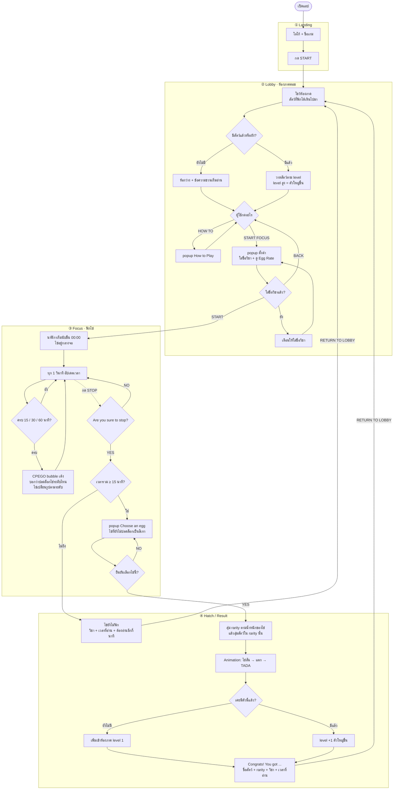
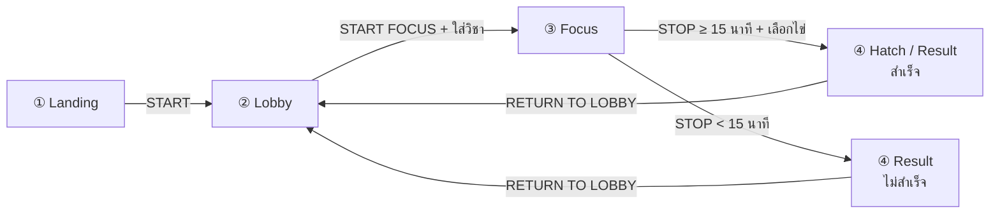

# CPE Egg Hatch · Phase 1 Feature Flowchart

เป้าหมาย D5: เล่นได้ครบหนึ่งรอบ (playable end-to-end MVP) ตั้งแต่เปิดแอปจนได้สัตว์กลับมาอยู่ในห้องภาค

## ขอบเขต Phase 1

| มีใน Phase 1 | ยังไม่มี (ไป Phase 2–3) |
|---|---|
| 4 หน้า: Landing → Lobby → Focus → Hatch/Result | Login / Signup / Google OAuth |
| นาฬิกานับขึ้น + ปลดล็อกไข่ 3 ระดับ (15 / 30 / 60 นาที) | แชท CPEGO แบบกล่องแชท |
| CPEGO เป็น popup/bubble เด้งตอนครบ milestone | Database (Phase 2) |
| สุ่มสัตว์ตาม rarity ของไข่ | CPE Dex, History, Analytics (Phase 3) |
| สัตว์ที่ได้ไปเดินใน Lobby (ตัวซ้ำ = level +1) | Advanced Sanctuary (Phase 3) |
| เก็บข้อมูลใน memory (ปิดแอปแล้วหาย) | |

## Flowchart ทั้งเกม

## ลำดับหน้า (สรุป)

## Feature ของแต่ละหน้า

### ① Landing
- โลโก้ + ชื่อเกม
- ปุ่ม `START` ไป Lobby

### ② Lobby
- ห้องภาคพร้อมสัตว์ที่ฟักได้ในรอบการเล่นนี้ เดินสุ่มไปมาแบบง่าย ขนาดตาม level
- ปุ่ม `HOW TO` เปิด popup อธิบายวิธีเล่น
- ปุ่ม `START FOCUS` เปิด popup ใส่ชื่อวิชา + ดู Egg Rate แล้วกด `START` ไปหน้า Focus

### ③ Focus
- นาฬิกานับขึ้น (นาที:วินาที)
- รูปไข่เปลี่ยนตามระดับที่ปลดล็อก
- CPEGO bubble เด้งตอนครบ 15 / 30 / 60 นาที แล้วหายเอง
- ปุ่ม `STOP` → popup ยืนยัน → ถ้าถึง 15 นาทีเปิด popup `Choose an egg` + ยืนยัน

### ④ Hatch / Result
- สุ่มสัตว์ + animation ฟักไข่
- ได้ตัวใหม่ → เพิ่มเข้าห้องภาค · ได้ตัวซ้ำ → level +1
- สรุปผล: สัตว์ที่ได้, วิชา, เวลาที่อ่าน
- ถ้าไม่ถึง 15 นาที โชว์หน้าไม่สำเร็จแทน
- ปุ่ม `RETURN TO LOBBY`

## กติกาเกม Phase 1

| ไข่ | เวลาขั้นต่ำ | Common | Rare | Epic | Legendary |
|---|---|---|---|---|---|
| ไข่รุ่นเรา | 15 นาที | 70% | 25% | 5% | 0% |
| ไข่รุ่นพี่ | 30 นาที | 40% | 40% | 17% | 3% |
| ไข่อาจารย์ | 60 นาที | 10% | 40% | 35% | 15% |

## สิ่งที่ตัดสินใจแทนไว้ (แก้ได้)

- หน้า Set up เดิมย่อเป็น popup ใน Lobby และหน้า Summary เดิมย่อเป็น popup `Choose an egg` ในหน้า Focus จะได้เหลือ 4 หน้าตามแผน
- ไม่มี database ข้อมูลทั้งหมด (สัตว์ในห้องภาค, รอบที่กำลังอ่าน) อยู่ใน object เดียวใน memory ปิดแอปแล้วเริ่มใหม่ Phase 2 ค่อยเปลี่ยนไปบันทึกลง database
- ตอนเดโมควรมีโหมดเร่งเวลา (เช่น 1 วินาที = 1 นาที) ไม่ต้องนั่งรอ 15 นาทีจริง
